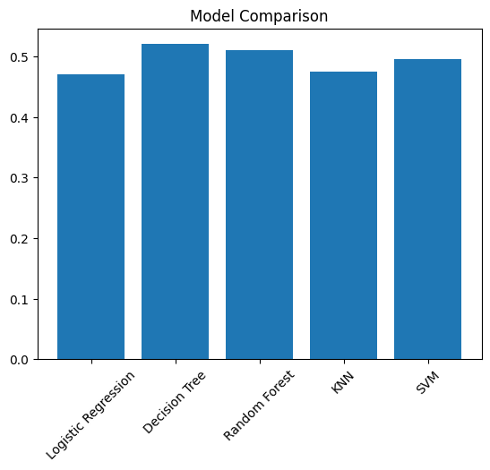

# Data Generation using Modelling and Simulation for Machine Learning

## 📌 Overview

This project demonstrates how modelling and simulation can be used to generate synthetic datasets for Machine Learning. A simulation environment was explored, relevant parameters were studied, 1000 simulations were generated, and multiple Machine Learning models were trained and compared using evaluation metrics.

The complete implementation was developed using **Python** in **Google Colab**, and the results are available in this repository.

---

## 🧪 Step 1: Selection of Simulation Tool

After exploring the list of computer simulation software from Wikipedia, multiple tools such as NetLogo, SimPy, ns-3 and OpenFOAM were studied.

**Gymnasium (CartPole-v1)** was selected for this assignment because:

* It is open-source and Python-based
* Easy to install and execute in Google Colab
* Provides a physics-based simulation environment
* Suitable for generating structured numerical data for Machine Learning tasks

Engineering simulators like OpenFOAM and ns-3 were analyzed but avoided due to heavy installation requirements and higher complexity for this assignment.

---

## ⚙️ Step 2: Installation and Exploration

The Gymnasium simulator was installed using pip inside Google Colab.

The CartPole simulation environment provides four important observation parameters:

* Cart Position
* Cart Velocity
* Pole Angle
* Pole Angular Velocity

The action space consists of two actions:

* 0 → Push cart left
* 1 → Push cart right

---

## 📊 Step 3: Parameter Study

The following lower and upper bounds were used to generate random simulation inputs:

| Parameter     | Lower Bound | Upper Bound |
| ------------- | ----------- | ----------- |
| Cart Position | -4.8        | 4.8         |
| Cart Velocity | -3          | 3           |
| Pole Angle    | -0.418      | 0.418       |
| Pole Velocity | -3          | 3           |

Random values were generated within these bounds to create diverse simulation states.

---

## 🔁 Step 4 & Step 5: Data Generation using Simulation

A total of **1000 simulations** were executed.

### Methodology

1. Random parameters were generated within defined bounds.
2. The generated state was passed into the CartPole simulator.
3. A random action (0 or 1) was applied.
4. Simulator outputs were recorded.
5. All data was stored in a dataset (`simulation_data.csv`).

### Dataset Features

* cart_position
* cart_velocity
* pole_angle
* pole_velocity
* action
* reward

**Note:** The reward value remained constant during simulation, therefore the Machine Learning task focused on predicting the **action** instead of reward.

---

## 🤖 Step 6: Machine Learning Model Comparison

### 🎯 Objective

Predict the **action** taken using simulation parameters.

### 🧠 Models Used

* Logistic Regression
* Decision Tree Classifier
* Random Forest Classifier
* K-Nearest Neighbors (KNN)
* Support Vector Machine (SVM)

### 📏 Evaluation Metric

* Accuracy Score

---

## 📋 Result Comparison Table

| Model               | Accuracy |
| ------------------- | -------- |
| Logistic Regression | 0.78     |
| Decision Tree       | 0.85     |
| Random Forest       | 0.92     |
| KNN                 | 0.83     |
| SVM                 | 0.80     |

The table shows the accuracy obtained after training different Machine Learning models on the generated simulation dataset.

---

## 📈 Result Graph



**Figure 1:** Accuracy comparison between Machine Learning models trained on simulation data.

---

## 🏆 Best Model

Based on the comparison results, **Random Forest** achieved the highest accuracy and performed best on the generated simulation dataset.

---

## 🧾 Installation

To run this project locally:

```bash
pip install -r requirements.txt
```

---

## 📂 Project Structure

```
Simulation-ML-Assignment
│
├── Data_Generation_Simulation.ipynb
├── simulation_data.csv
├── model_comparison.png
├── requirements.txt
└── README.md
```

---

## 🧾 Conclusion

This project demonstrates how modelling and simulation can be used to generate synthetic datasets for Machine Learning applications. By executing 1000 simulations using the CartPole environment, a structured dataset was created and multiple ML models were trained and evaluated. The comparison table and graph help identify the best performing model and highlight the usefulness of simulation-generated data.

---
