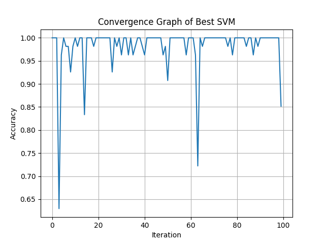

# 📊 Optimized SVM on Multi-Class Dataset

## 📌 Objective

The objective of this assignment is to optimize a Support Vector Machine (SVM) model on a multi-class dataset using multiple samples and evaluate its performance.

---

## 📁 Dataset

* Dataset used: Wine Dataset (multi-class classification)
* Number of features: 13
* Number of classes: 3

---

## ⚙️ Methodology

1. **Data Preprocessing**

   * Standardized data using `StandardScaler`

2. **Train-Test Split**

   * 70% training and 30% testing
   * Performed for **10 different samples**

3. **Model Used**

   * Support Vector Machine (SVM)

4. **Hyperparameter Optimization**

   * Used **Optuna**
   * Number of iterations: **100 per sample**
   * Parameters tuned:

     * `C` (Regularization parameter)
     * `gamma`
     * `kernel` (linear, rbf, poly)

---

## 📊 Results Table

| Sample | Accuracy | Kernel | C         | Gamma    |
| ------ | -------- | ------ | --------- | -------- |
| S1     | 1.0000   | rbf    | 85.981990 | 0.036984 |
| S2     | 1.0000   | linear | 68.746561 | 0.186704 |
| S3     | 0.9815   | linear | 15.105570 | 0.556020 |
| S4     | 0.9815   | linear | 79.383739 | 0.108295 |
| S5     | 0.9815   | linear | 88.052180 | 0.527690 |
| S6     | 0.9815   | rbf    | 1.408324  | 0.100763 |
| S7     | 1.0000   | poly   | 44.406228 | 0.893401 |
| S8     | 1.0000   | rbf    | 74.190742 | 0.186312 |
| S9     | 0.9815   | rbf    | 44.894347 | 0.002177 |
| S10    | 1.0000   | poly   | 19.662932 | 0.043765 |

---

## 📈 Convergence Graph

Below is the convergence graph for the best-performing sample:



### 🔍 Observation:

* Accuracy increases with iterations
* Some fluctuations occur due to parameter exploration
* The model converges to near-optimal accuracy

---

## ▶️ How to Run

```bash id="run123"
pip install pandas numpy scikit-learn matplotlib optuna
python main.py
```

---

## 📂 Output Files

* `results.csv` → Performance comparison table
* `convergence.png` → Convergence graph

---

## 🧠 Conclusion

* SVM achieves high accuracy on this dataset
* Hyperparameter tuning improves performance significantly
* Different kernels perform well depending on sample
* RBF and Polynomial kernels often give best results

---

## 👨‍🎓 Student Details
* Name - Manmeet Singh
* Roll no - 102317039
